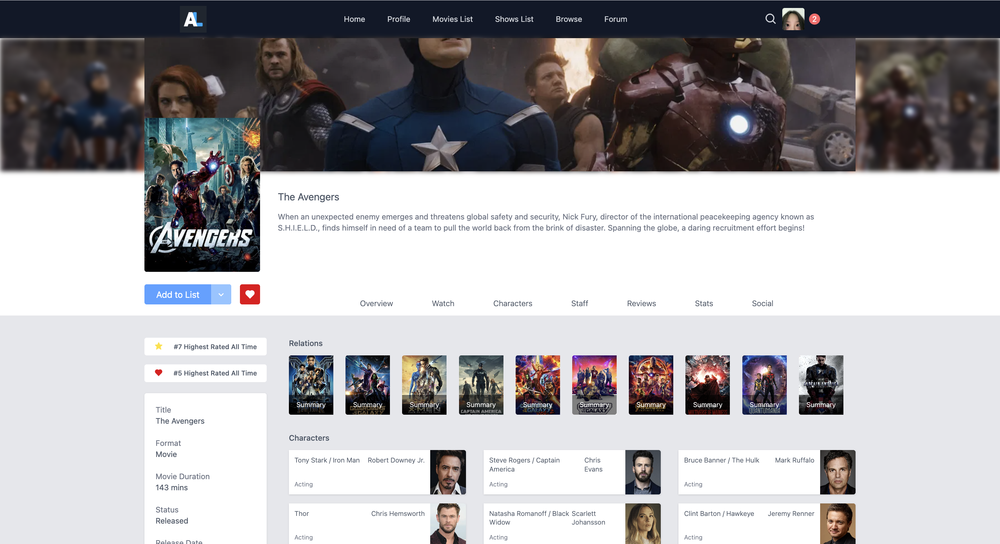
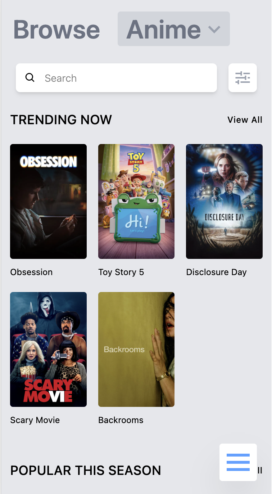
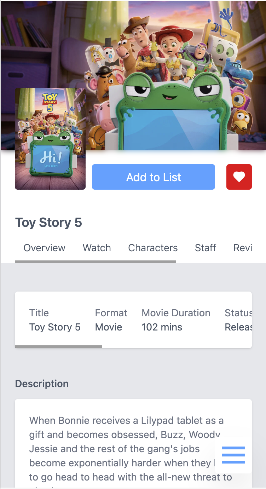
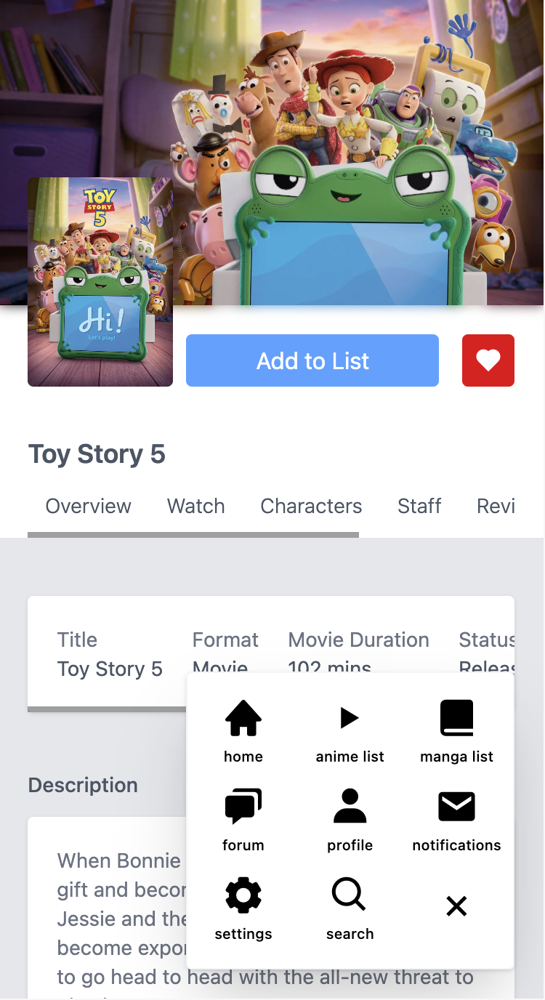

# MovieCritic

A full-stack movie tracking application that allows users to browse movies, view detailed information, save favorites, and manage personal watching statuses. Built with React, TypeScript, Express, MongoDB, and the TMDB API.

## Live Demo

Frontend:  
https://moviecritic-seven.vercel.app/

Backend:  
https://moviecritic-mi3f.onrender.com

## Screenshots

### Home


### Overview


### Browse


### Movie Details




### Movies List


### Mobile

<div>
    
    
    
    
</div>

## Features

- Browse movies using the TMDB API
- View detailed movie information
- Add movies to favorites
- Manage watching and completed movie lists
- Responsive design
- Built a REST API with Express and MongoDB for managing movie data
- Implemented CRUD operations for movie list management

## Tech Stack

### Frontend

- React
- TypeScript
- Tailwind CSS
- React Router
- Vite

### Backend

- Node.js
- Express
- TypeScript
- MongoDB
- Mongoose

### External Services

- TMDB API
- MongoDB Atlas
- Vercel
- Render

## Project Structure

```text
moviecritic/
├── frontend/
├── backend/
├── screenshots/
└── README.md
```

## Installation

### Clone Repository

```bash
git clone https://github.com/yourusername/moviecritic.git
```

### Frontend

```bash
cd frontend

npm install

npm run dev
```

### Backend

```bash
cd backend

npm install

npm run dev
```

## Environment Variables

### Frontend (.env)

```env
VITE_API_URL=http://localhost:3000
```

### Backend (.env)

```env
MONGO_URI=your_mongodb_connection_string
```

## Key Implementation

- Created reusable React components for movie cards, lists, and UI sections
- Managed application state with React hooks
- Built Express controllers and routes for movie list management
- Created MongoDB schemas and models using Mongoose
- Implemented CRUD functionality for movie lists
- Configured environment variables for local and production deployments
- Deployed frontend with Vercel and backend with Render

## Future Improvements

- Add authentication
- Add user profiles
- Add reviews and ratings
- Improve validation and error handling

## License

This project is for educational and portfolio purposes.