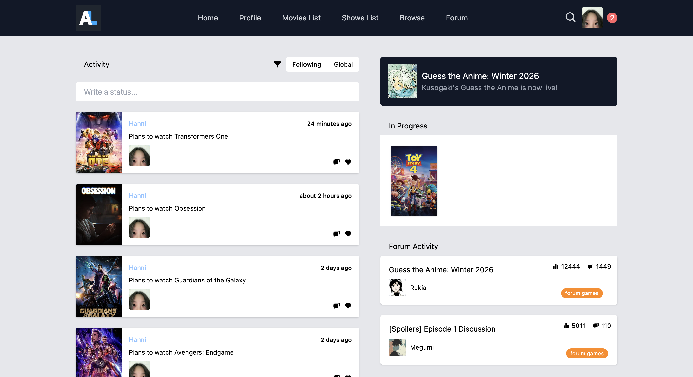
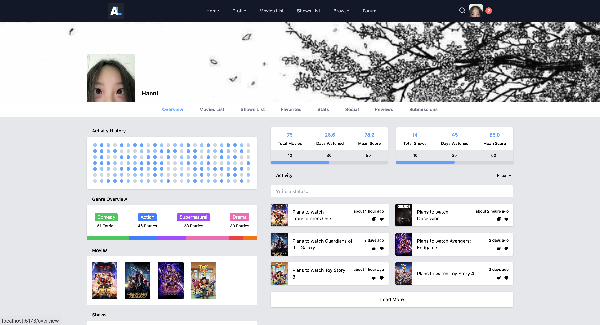
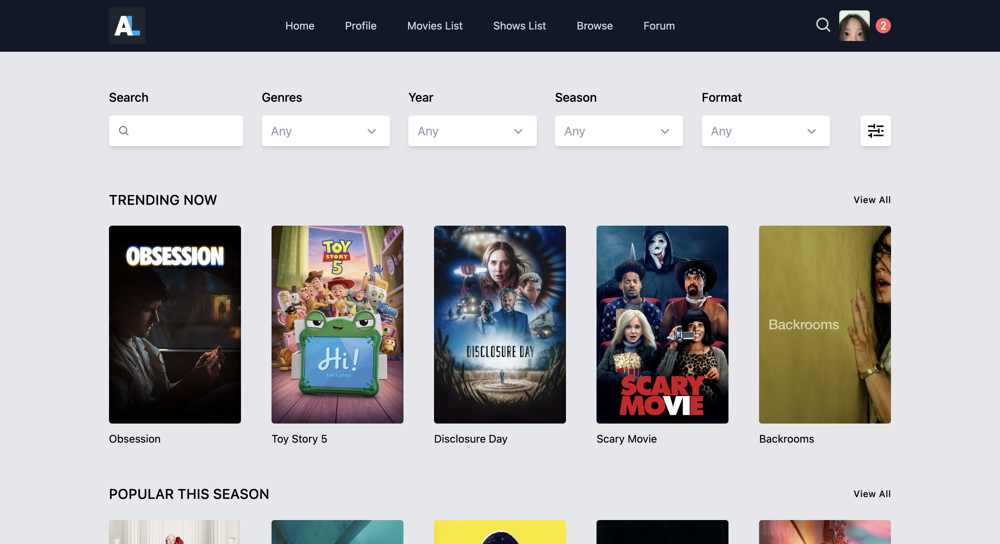
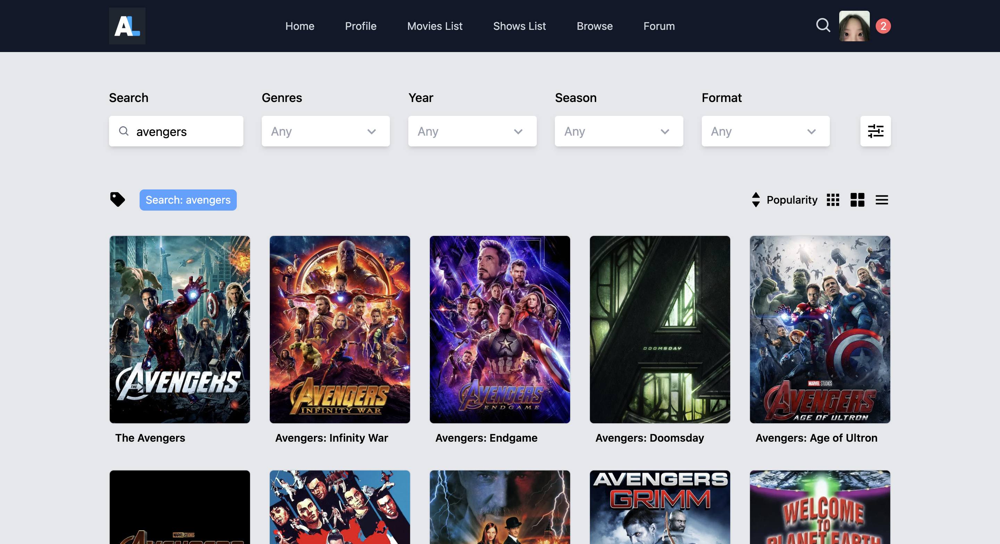
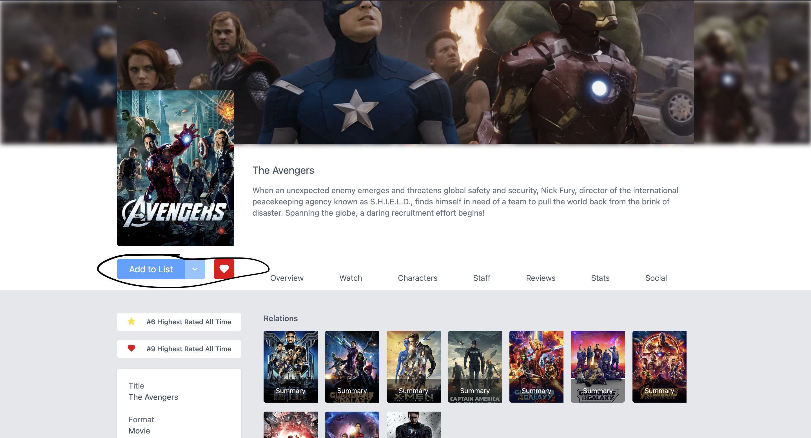
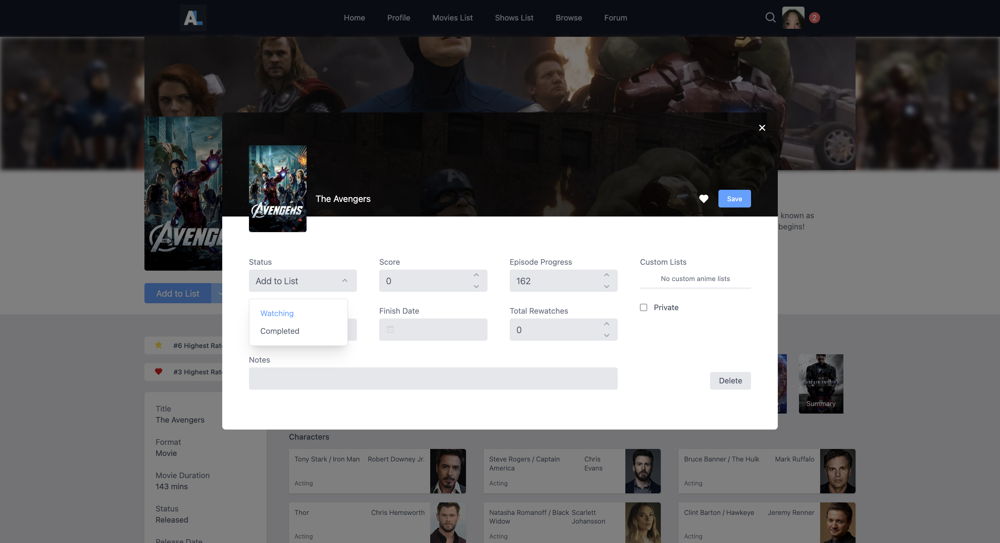
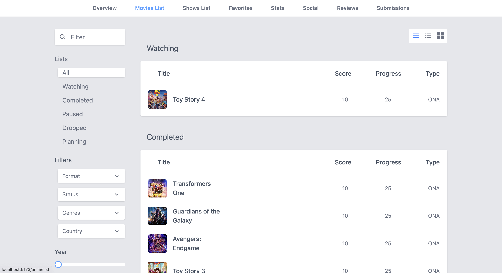
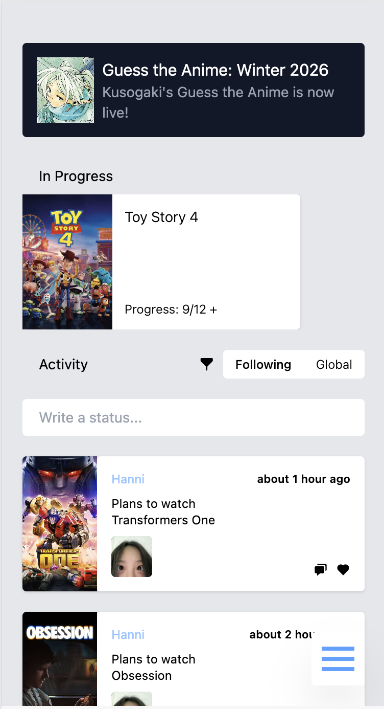

# MovieCritic

A full-stack movie tracking application built with React, TypeScript, Express, MongoDB, and the TMDB API.

## Live Demo

Frontend:
(your Vercel URL)

Backend:
(your Render URL)

## Screenshots

### Home 

### Overview 

### Browse 

### Movie Details

### Movies List 

### Mobile 

## Features

- Browse movies using the TMDB API
- View movie details
- Add movies to favorites
- Manage watching and completed movie lists
- Responsive design
- REST API backend
- Full-stack deployment

## Tech Stack

### Frontend
- React
- TypeScript
- Tailwind CSS
- React Router
- Vite

### Backend
- Node.js
- Express
- TypeScript
- MongoDB
- Mongoose

### External Services
- TMDB API
- MongoDB Atlas
- Vercel
- Render

## Project Structure

movie-critic/
├── frontend/
├── backend/

## Installation

### Clone repository

git clone your-repository-url

### Frontend

cd frontend

npm install

npm run dev

### Backend

cd backend

npm install

npm run dev

## Environment Variables

### Frontend (.env)

VITE_API_URL=http://localhost:3000

### Backend (.env)

MONGO_URI=your_mongodb_connection_string

## Future Improvements

- Add authentication
- Add user profiles
- Add reviews and ratings
- Improve validation and error handling